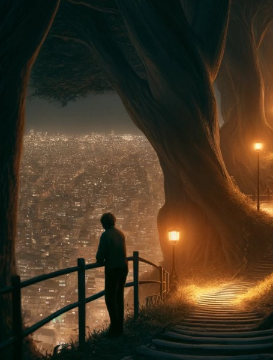
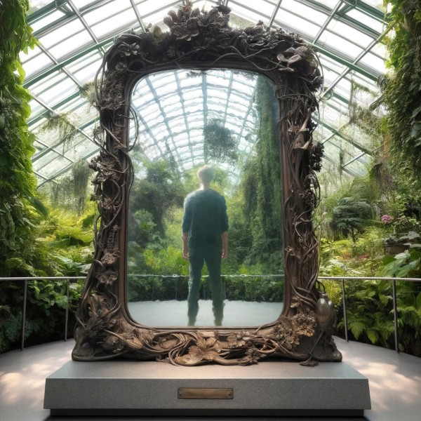

# Казка про хлопчика котрий вижив

## Глава перша

### Частина перша
> Де ми знайомимося з хлопчиком котрий вижив

В далекій країні, за інших часів жив собі хлопчик котрий вижив. Взагалі, світ має багато прикладів подібних хлопчиків. Декотрим з них довелося пережити смертельне заклинання злого чарівника, а декотрим просто вдалося дожити до сорока рочків. Але їх всіх об'єднувала одна риса — вони вижили, і дожили до того моменту щоб стати героєм нашої казки. А от який саме хлопчик буде героєм саме цієї казки — це ми з вами залишимо на розсуд критиків та інших читачів, сама історія від цього аж ніяк не зміниться.

### Частина друга
> Де Хлопчик гуляє по Місту

Місто в якому жив хлопчик було не дуже старим, але за свою історію вже встигло обрости парками, замками, автостоянками біля торгових центрів, та іншими містичними місцями, де з головними героями оповідань люблять трапляються різні потаємні та магічні події, що докорінно змінюють їх подальше життя.

Одного тихого вечора, по одному з таких місць і гуляв наш Хлопчик. Це був красивий парк розташований на околиці центру Міста. Вузькі алеї ледь освітлені помаранчевими ліхтарями мережували між величезними деревами, іноді заводячи в нібито здавалося непрохідні тупики, але потім, як згадавши що вони не якісь там лісові тропки, а — поважні алеї в майже центрі міста, різко повертали вбік, відкидали хащі, і, ніби вибачаючись, відкривали неймовірні краєвиди на Місто.

Хлопчик стояв на краю пагорбу, опершись на поручні і дивився на вечірнє Місто. Місто мерехтіло безліччю вогників ліхтарів. За кожним з них була прихована своя історія — вечір з сім'єю, запізня робота, перший поцілунок чи остання вечеря. Але це все це було далеко і поглиналося Містом. Місто заспокоювало. Хлопчик любив такі моменти.

### Частина третя
> Де починається казка

— Мабуть, піду вже додому. — тихо промовив він, ніби вибачаючись перед парком. Хлопчик розвернувся і тихо пішов алеєю, аж раптом — край його ока побачив щось незвичне. Він повернувся — це було дзеркало. Величезне дзеркало, що стояло на гранітному постаменті. Хлопчик підійшов ближче щоб роздивитися. 

Рама дзеркала була відлита з бронзи і являла собою хитросплетіння квітів та гілок що плавно переходили в коріння яке вростало в постамент. На постаменті була написана сьогоднішня дата і тире… Просто тире — без другої дати. Сама поверхня дзеркала була зроблена як з полірованого металу, і майже ідеально відбивала Місто за спиною хлопчика та його здивоване обличчя.

— Це щось нове. Цікаво, коли його поставили?

Хлопчик ретельно роздивився дзеркало, і рефлекторно поправив зачіску.

— Красиво. Трохи дивно, але — красиво.

Хлопчик ще раз ретельно подивився у відображення. Мабуть, через легкий вітерець чи через відлуння Міста — поверхня дзеркала легко вібрувала, змазуючи відображення і роблячи його трохи нереальними. Слідуючи своїй давній традиції, та бавлячи свою дитячу частину що любила гратися у магію, він притулив долоню до рами дзеркала і сказав:

— Ну, привіт.  
— Привіт. — відповіло Дзеркало.

## Глава друга

### Частина перша
> Де ми спостерігаємо за Хлопчиком що бореться за своє життя декілька років потому, бо, як обізнані читачі — прекрасно розуміємо що символізують величезні магічні дзеркала, і до чого приводять розмови з ними

— Грьобаний! Шмат! Металу! Казку йому подавай, #%!$#%=! — прохрипів Хлопчик, відпльовуючись від солоної води з хвилі що майже не змила його з борту. Швидко, щоб встигнути до наступної хвилі, він ще на третину спустив та максимально підтягнув парус, після чого скермував яхту під кутом до наступної хвилі.

— Отута, зараз, здохну, Дзеркальце, і буде тобі казка, тоді пропустиш, портал недороблений?!! — крикнув він у повітря, але вітер уніс його слова в нікуди.

— А воно точно того варте?!! Там справді те що мені потрібно? Лади. Я тут. Ще досі живий. Досі!!! Все буде ОК — знайду твою казку та розповім. Пропустиш ти мене — нікуди не дінешся!

Хвиля накрила яхту, але підкоряючись легким та впевненим рухам керма в умілих руках хлопчика — вона розрізала хвилю як лезо і полетіла далі.

— Я живий!!! — встиг вигукнути він, перед тим як побачив темну тінь скелі і відчув удар по яхті, котрий викинув його у повітря немов м'ячик для гольфу. «Живий» — посміхнувся Хлопчик і каменем влетів у воду.

— Живий. Знайду. Розповім — даси пройти, і буде все як в казці. — хвиля накрила його з головою.

### Частина друга
> Штиль

Море лежало сумирне і тихе — наче ніякого шторму ніколи і не було. Доріжка від повного місяця тягнулась від самого обрію до піщаного пляжу на котрому сидів Хлопчик. Він замислено дивився на море і перебирав пісок рукою. Іноді йому траплялись невеличкі камінці — тоді він намагався їх докинути до води, але вона була далеко. В якийсь момент камінці закінчилися — тоді Хлопчик встав, стряхнув пісок і розвернувся йти в… просто йти далі. 

Прямо перед ним височів кам'яний мур. Мур тягнувся вздовж всього узбережжя — наскільки вистачало зору.

 — Якого… — прошепотів Хлопчик, — Це якась мара. — він зробив два кроки вперед і простягнув руку — мур був справжній.

 Хлопчик відійшов від муру і роздивився по сторонам — в сотні кроків виднілася величезна брама. Хлопчик змахнув залишки піску з голови і пішов до неї.

 Брама була відчинена навстіж, відкриваючи вид на красиве старовинне місто. Біля брами сиділа сторожа і грала в карти, але зараз, побачивши хлопчика — вони застигли і, таке відчуття, що боялись не те що поворухнутися — а відвести від нього очі. Хлопчик зайшов у браму — сторожа не ворухнулась.

### Частина третя
> Де закінчується Казка, котру ми всі чули багато разів

Місто чарувало своєю непослідовністю та химерністю. Старі — як з кіно про середньовіччя, вулиці перемежовувались з сучасними скляними кварталами. З кам'яних будівель виростали хмарочоси на вершинах котрих майоріли замкові башти. Це був сюр, але сюр реальний, справжній. Хлопчик йшов старою вулицею вкладеною бруківкою, та освітленою пурпурним неоном. Над головою іноді пролітав монорейковий потяг. 

Хлопчик йшов до центральної площі. Чому він був в цьому впевнений? Бо саме там височіла башта з годинником, по циферблату котрого невблаганно рухалась одинока хвилинна стрілка. Башта нависала над усім містом, давила його — нагадувала скільки хвилин залишилось до кінця години. До початку наступного сторіччя темряви і сподівань. Саме так як розповідалося в історії, яку Хлопчик знав ще з дитинства — про іншого хлопчика, що подорожував з гусьми. Але зараз — він став її героєм, і, на щастя для мешканців міста, він розумів що робити. Перехрестя за перехрестям він наближався до центру. Мешканці міста звертали на нього увагу та починали йти за ним — не зупиняли, бо бачили — він знає.

Хлопчик вийшов на центральну площу і подивився на башту-годинник — залишалось трохи менше десяти хвилин. Він підійшов до першої-ліпшої крамниці зі смаколиками. Площа завмерла — було чути тільки дзвін нічного повітря. Продавець крамниці зі страхом і надією подивився на Хлопчика — Хлопчик дістав з кишені монетку, поклав її на прилавок і показав пальцем на булочку.

## Глава третя

### Частина перша і остання
> Імператор

«Таким чином, завдяки розширенню торговельної присутності Балтійської корпорації «Вінетта-Імперіал» на міжнародних ринках її вартість за останні півроку зросла майже вдвічі.» — Хлопчик відклав телефон. «В два рази більше ніж незліченність — це краще ніж незліченність.» — посміхнувся він про себе.

З моменту як він зняв прокляття з зачарованого міста Вінетти, пройшло лише декілька років, а вони вже стали наймогутнішою торговельною імперією світу. Багато часів Вінетта залишалась під водою — заклята за зухвале ставлення своїх мешканців до чужинців. Але, раз на сторіччя воно підіймалось з пучин — щоб отримати шанс звільнитися, якщо чужинець, з власної волі, купить щось у місцевого. І тепер, коли їм пощастило — їх було не спинити.

— Пане, дозвольте, ми його привезли. — асистентка, немов метелик, впурхнула до кабінету.  
— Дякую. Все без проблем?  
— Так.  
— Ще раз дякую. Ви вільні. — асистентка випурхнула з кабінету. Хлопчик підвівся і пішов до оранжереї.

Там на нього вже чекало Дзеркало.

— Ну, привіт ще раз. — мовив Хлопчик.  
— Привіт.  
— Я знайшов казку, як ти просило.  
— Я знаю. — з усмішкою в голосі відповіло Дзеркало.  
— Але… Мені і тут гарно, знаєш? Я поки нікуди йти не хочу.  
— Як забажаєш. Я завжди відкрите для тебе.  
— Дякую. До зустрічі?  
— Бувай. — відповіло Дзеркало.

Біля виходу Хлопчик озирнувся:

— А воно варто того?

Але Дзеркало не відповіло.

## Епілог
> Котрого неповинно було бути

В красивому парку, розташованому на околиці цента Міста, біля величезного Дзеркала сидів хлопчик.

— І я зможу пройти крізь тебе, і опинитись де захочу?  
— Ти опинишся там де будеш щасливий. Це трохи різні речі.  
— І немає ніякої ціни? Ні, там, душі, чи чийогось життя?  
— Ціною буде твоя майбутня історія. Мені цього достатньо.  
— Але… Так не буває. Я так не зможу!  
— Не хвилюйся. Ти розумний. Щось собі придумаєш, щось — забудеш. Ідеш?  
— Так. Йду.

---
Квітень 2022.  
CC BY-NC-SA, Той самий Хлопчик.  
Ілюстрації DALL-E/ChatGPT-4 та трохи фотошопу.
